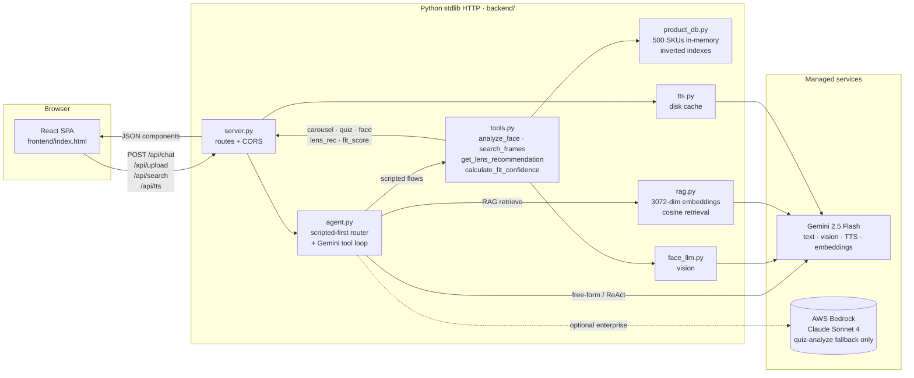
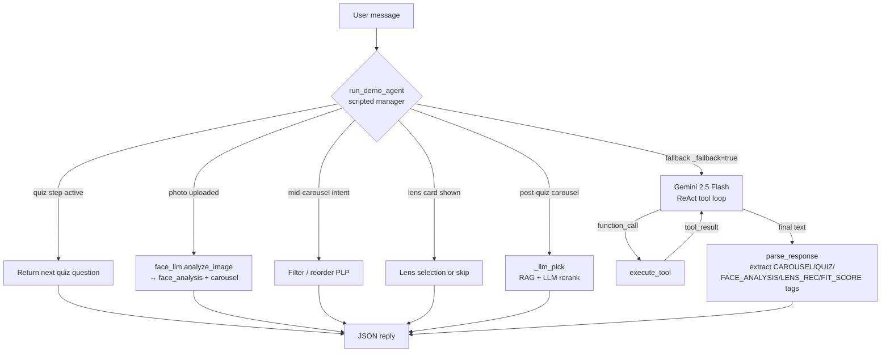

# Claire AI — Unified Eyewear Shopping Assistant

> A conversational AI stylist for Lenskart that unifies a frame quiz, face-based
> recommendations, lens guidance, face-scan PLP ordering, and a photo-based
> fit-confidence widget into one chat.
> Problem #15 · Online · AI Shopping Experience (Score 82 ⭐⭐⭐⭐⭐).

The app is **offline-first** — the React SPA runs end-to-end without any backend
keys; API calls enhance the experience but never block it.

---

## Table of contents

1. [Setup](#setup)
2. [Environment variables](#environment-variables)
3. [Architecture](#architecture)
4. [Sample inputs and expected outputs](#sample-inputs-and-expected-outputs)
5. [Scripts](#scripts)
6. [Further reading](#further-reading)

---

## Setup

### Prerequisites

| Tool | Version | Notes |
|---|---|---|
| Python | ≥ 3.10 | Uses stdlib only — **no pip install step required** |
| macOS / Linux | any | Tested on macOS 14 and Ubuntu 22.04 |
| Chrome / Safari / Firefox | modern | Frontend loads React + Tailwind via CDN |

> A `requirements.txt` is included but lists stdlib only; `pip install -r
> requirements.txt` is a no-op unless you want the optional `anthropic` SDK.

### 1 · Clone & configure

```bash
git clone <this-repo>
cd lenskart-claire
cp .env.example .env          # then fill in GEMINI_API_KEY (and BEDROCK_BEARER_TOKEN if you have one)
```

`.env` is gitignored. Demo mode works without any keys — the quiz, face
analysis, lens guidance, and carousel all run client-side.

### 2 · Run

```bash
bash start.sh                 # default — port 8000
# or with overrides
PORT=3000 bash start.sh
```

`start.sh` sources `.env` automatically and auto-kills anything bound to `$PORT`
so repeat runs stay clean.

Open **http://localhost:8000** — the SPA loads automatically.

### 3 · Verify

```bash
curl http://localhost:8000/health
# → {"status": "ok", "service": "Claire AI", "version": "1.0.0"}
```

### 4 · (One-time) build the product catalog

The repo ships with a pre-built catalog + embeddings. If you want to rebuild
from the raw Lenskart product feed:

```bash
python3 backend/build_catalog.py           # 500 balanced-sample products
python3 backend/retag_catalog.py --embed   # vision-retag + RAG embeddings
```

See [Scripts](#scripts) below for more detail.

---

## Environment variables

**Never hardcode secrets** — export them in your shell or in a wrapper script.

| Variable | Default | Purpose |
|---|---|---|
| `GEMINI_API_KEY` | *(empty)* | Primary LLM for chat, vision, TTS, embeddings. Get one at [aistudio.google.com](https://aistudio.google.com/app/apikey). |
| `GEMINI_AGENT_MODEL` | `gemini-2.5-flash` | Main tool-use model. **Do not set to `gemini-3.*`** — those IDs 404 on the public API. |
| `GEMINI_EMBED_MODEL` | `gemini-embedding-2` | 3072-dim RAG embeddings. |
| `BEDROCK_BEARER_TOKEN` | *(empty)* | Optional AWS Bedrock fallback for `/api/quiz-analyze` only. |
| `BEDROCK_REGION` | `ap-south-1` | Bedrock region. |
| `BEDROCK_MODEL` | `apac.anthropic.claude-sonnet-4-20250514-v1:0` | Claude Sonnet 4 inference profile (APAC). |
| `ANTHROPIC_API_KEY` | *(empty)* | Legacy — no longer used for the main chat loop. |
| `PORT` | `8000` | HTTP server listen port. |

> **Demo mode** — with no keys set, the scripted conversation manager runs the
> full quiz, face analysis, lens guidance, and carousel flows client-side. Only
> free-form post-quiz Q&A requires a real Gemini key.

---

## Architecture

### High-level request flow



### Agent routing (scripted-first)



### Repo layout

```
lenskart-claire/
├── backend/
│   ├── server.py             # stdlib HTTP server, routes, upload handling
│   ├── agent.py              # scripted router + Gemini function-calling loop
│   ├── tools.py              # 4 tool implementations (analyze_face etc.)
│   ├── product_db.py         # in-memory ProductDB + inverted indexes
│   ├── rag.py                # embedding index, auto-refresh on catalog hash
│   ├── recommend.py          # LLM-backed product reranker
│   ├── gemini.py             # quiz-analyze + _heuristic_tags fallback
│   ├── bedrock.py            # enterprise Bedrock transport (fallback)
│   ├── face_llm.py           # vision: face shape + fit score
│   ├── tts.py                # Gemini TTS + disk cache + precache
│   ├── build_catalog.py      # raw.tsv → products.csv/json
│   ├── retag_catalog.py      # one-shot vision retagger
│   └── data/
│       ├── raw.tsv           # Lenskart product feed (3.5k rows)
│       ├── products.csv      # 500-SKU curated catalog
│       ├── products.db.json  # parsed snapshot
│       ├── rag.index.json    # 500 × 3072-dim embeddings
│       └── tts_cache/        # MP3 chunks per phrase
├── frontend/
│   └── index.html            # React 18 SPA, ~3,754 lines, CDN only
├── claire-1-pager.pdf        # submission-ready 1-pager
├── CLAIRE.md                 # pitch / 1-pager
├── CLAUDE.md                 # deep dive for contributors
├── README.md                 # you are here
├── requirements.txt          # stdlib only (anthropic SDK optional, currently unused)
└── start.sh                  # bootstrap: kill port, python3 backend/server.py
```

---

## Sample inputs and expected outputs

### `GET /health`

```bash
curl http://localhost:8000/health
```

```json
{ "status": "ok", "service": "Claire AI", "version": "1.0.0" }
```

### `POST /api/chat` — starting a quiz

**Request**
```bash
curl -X POST http://localhost:8000/api/chat \
  -H 'Content-Type: application/json' \
  -d '{
    "messages": [{"role": "user", "content": "hi"}],
    "session_data": {}
  }'
```

**Response** (abridged)
```json
{
  "response": "",
  "components": [{
    "type":     "quiz",
    "step":     1,
    "total":    8,
    "key":      "gender",
    "question": "Are these frames for you, for him, for her, or for everyone?",
    "options":  ["For me", "For him", "For her", "For everyone"]
  }],
  "session_data": { "quiz_step": 0, "quiz_answers": {} }
}
```

### `POST /api/chat` — mid-conversation filter in Hindi

**Request**
```bash
curl -X POST http://localhost:8000/api/chat \
  -H 'Content-Type: application/json' \
  -d '{
    "messages": [{"role": "user", "content": "साढ़े 3000 से ज्यादा का फ्रेम दिखाए"}],
    "session_data": { "quiz_step": 99 }
  }'
```

**Response** — 500-product catalog is filtered to `above_3500` (साढ़े +500) and the correct premium frames are returned.
```json
{
  "response": "ये रहे आपके लिए 6 फ्रेम — above ₹3,500 + eyeglasses + adult",
  "components": [{
    "type": "carousel",
    "title": "आपके लिए चुने गए",
    "frames": [
      { "id": "LK-134951", "name": "John Jacobs JJ Tints …",
        "price": 3100, "frame_shape": "aviator",
        "image_urls": ["https://static5.lenskart.com/…"],
        "tags": ["classic", "warm", "above_3000", "adult"] },
      "…"
    ]
  }],
  "session_data": { "quiz_step": 99 }
}
```

### `POST /api/upload` — selfie → face analysis

```bash
curl -X POST http://localhost:8000/api/upload \
  -H 'Content-Type: application/json' \
  -d '{ "image": "data:image/jpeg;base64,/9j/4AAQSkZJRgABAQAAAQABAAD…" }'
```

```json
{
  "success":            true,
  "image_url":          "/uploads/5f3c….jpg",
  "shape":              "Oval",
  "confidence":         87,
  "face_width":         "Medium",
  "recommended_styles": ["wayfarer", "aviator", "round", "cat-eye"],
  "celebrity_match":    "Priyanka Chopra"
}
```

### `POST /api/search` — quiz-tag-driven filtering

```bash
curl -X POST http://localhost:8000/api/search \
  -H 'Content-Type: application/json' \
  -d '{
    "quiz_tags": {
      "gender_pref":      "female",
      "frame_shape_pref": "cat-eye",
      "budget":           "under_1500",
      "vision_need":      "single_vision"
    }
  }'
```

```json
{
  "success":     true,
  "no_match":    false,
  "total_found": 35,
  "results":     [ { "id": "LK-133742", "name": "…", "price": 1200,
                     "frame_shape": "cat-eye", "color": "tortoise" }, "…" ],
  "applied_filters": { "gender": "female", "frame_shape": "cat-eye",
                       "price_max": 1500, "has_power": true,
                       "type": "eyeglasses" }
}
```

### `POST /api/quiz-analyze` — tag extraction from a free-text answer

```bash
curl -X POST http://localhost:8000/api/quiz-analyze \
  -H 'Content-Type: application/json' \
  -d '{ "response": "main fashion ke liye leke mujhe dedh hazaar ke aaspaas ka chahiye" }'
```

```json
{
  "original_response":   "main fashion ke liye leke mujhe dedh hazaar ke aaspaas ka chahiye",
  "detected_language":   "hi",
  "language_name":       "Hindi",
  "english_translation": "I want it for fashion, around ₹1500",
  "tags": {
    "budget":    "around_1500",
    "lifestyle": "fashion",
    "trend":     "trendy"
  },
  "confidence": 92
}
```

### `GET /api/tts?text=...&lang=en`

Returns a JSON envelope of base64-encoded MP3 chunks the frontend plays
sequentially — disk-cached on first hit.

```json
{ "success": true, "mime": "audio/mpeg", "chunks": ["<base64>", "…"], "source": "cache" }
```

---

## Scripts

| Command | What it does |
|---|---|
| `bash start.sh` | Launch the server (auto-kills port 8000, loads `.env`). |
| `python3 backend/build_catalog.py` | Parse `data/raw.tsv` → 500-product `products.csv`/`.db.json`. |
| `python3 backend/build_catalog.py --all` | Keep every row in the feed (~3 500 SKUs). |
| `python3 backend/retag_catalog.py` | Vision-retag colour / shape / face-fit by looking at each product image (resumable via `retag_results.jsonl`). |
| `python3 backend/retag_catalog.py --embed` | Also rebuilds the RAG index in-process. |

---

## Further reading

- [CLAUDE.md](CLAUDE.md) — deep-dive for contributors (feature internals, state, design system, code map).
- [CLAIRE.md](CLAIRE.md) + [claire-1-pager.pdf](claire-1-pager.pdf) — submission-ready 1-pager for Problem #15.
- [frontend/index.html](frontend/index.html) — single-file React SPA; the `CLIENT_FRAMES` / `CLIENT_FACE_SHAPES` / `I18N` constants near the top power offline / bilingual mode.
